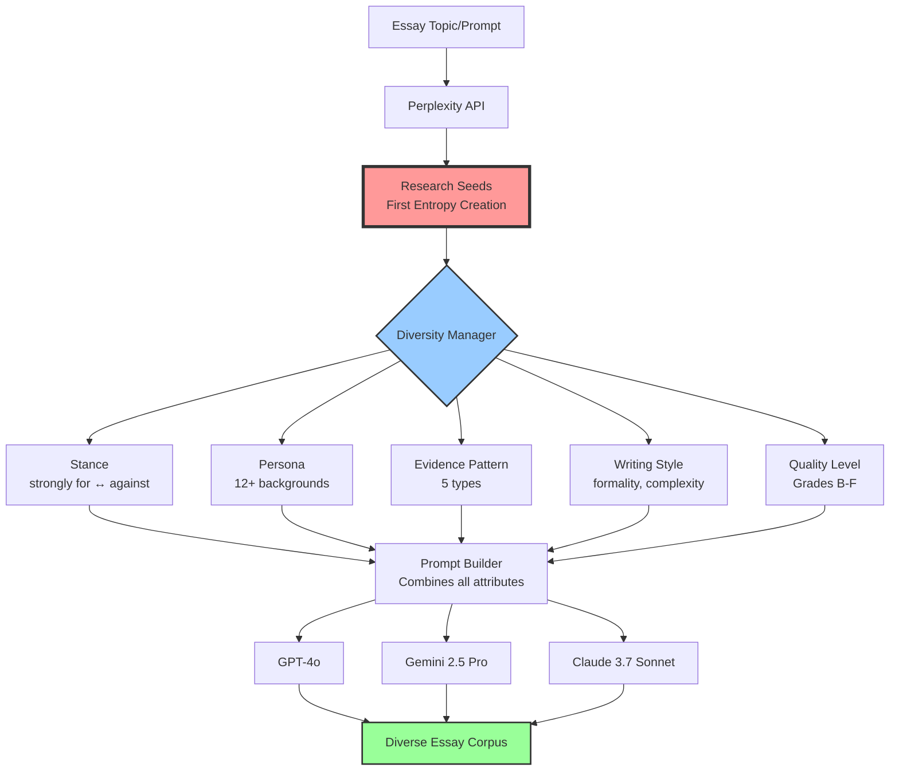

```mermaid
graph TD
    A[Essay Topic/Prompt] --> B[Perplexity API]
    B --> C[Research Seeds<br/>First Entropy Creation]
    C --> D{Diversity Manager}
    
    D --> E1[Stance<br/>strongly for ↔ against]
    D --> E2[Persona<br/>12+ backgrounds]
    D --> E3[Evidence Pattern<br/>5 types]
    D --> E4[Writing Style<br/>formality, complexity]
    D --> E5[Quality Level<br/>Grades B-F]
    
    E1 & E2 & E3 & E4 & E5 --> F[Prompt Builder<br/>Combines all attributes]
    
    F --> G1[GPT-4o]
    F --> G2[Gemini 2.5 Pro]
    F --> G3[Claude 3.7 Sonnet]
    
    G1 & G2 & G3 --> H[Diverse Essay Corpus]
    
    style C fill:#ff9999,stroke:#333,stroke-width:4px
    style D fill:#99ccff,stroke:#333,stroke-width:2px
    style H fill:#99ff99,stroke:#333,stroke-width:2px
```